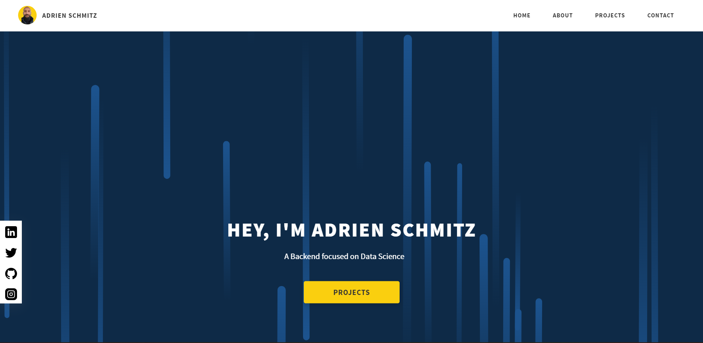
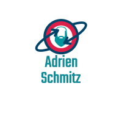

# Titulo do Projeto
[(Back to top)](#project-title)

<h2>Django - Portfólio</h2>

 Um portifólio em Django

- [Titulo do Projeto](#project-title)
- [Caracteristicas](#table-of-contents)
- [Começando](#começando)
- [Tecnologias](#tecnologias))
- [Screenshots](#screenshots))
- [License](#license)
- [Footer](#footer)

# Caracteristicas

Design baseado no projeto do <a rel="noreferrer" target="_blank" href="https://rammaheshwari.com">Ram Maheshwari</a>

- [x] Perfil
- [x] Contato

  # Começando
  [(Back to top)](#começando)

  Ter uma instalação do <a href="https://www.python.org/downloads/release/python-399/"> Python 3.10</a>

- Clone esse repositório.
- No terminal:
  - Ir ao diretório do projeto: cd <diretorio>
  - python3.10 -m venv venv
  - Ativar a maquina virtual: venv\Scripts\activate
  - Atualizar o pip: pip install --upgrade pip
  - Instalar os requisitos: pip install -r requirements.txt
  - Crie um super usuario: python manage.py createsuperuser
  - Para rodar o projeto: python manage.py runserver
  - Para acessar o site: No navegador http://127.0.0.1:8000/portfolioapp/
  - Para acessar o admin: //127.0.0.1:8000/admin

# Tecnologias
[(Back to top)](#tecnologias)

-[Python] (<a href="https://www.python.org/" rel="nofollow">https://www.python.org/</a>)  -[Django] (<a href="https://www.djangoproject.com/" rel="nofollow">https://www.djangoproject.com/</a>)

# Screenshots
[(Back to top)](#screenshots)

 

  

 
# License
[(Back to top)](#license)

<a href="LICENSE.md">MIT</a>
 
# Footer
[(Back to top)](#footer)

